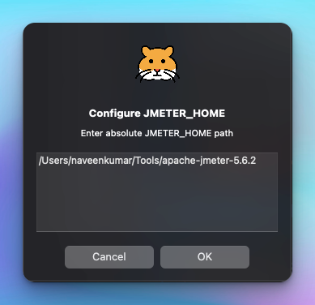
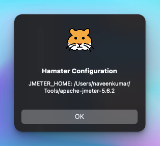

## Setup

If you want to install Hamster, please refer to [this](../mac/install.md) before proceeding.

The following are the prerequisites for setting up `Hamster` properly.

- [Apache JMeter](https://jmeter.apache.org)

## Setup JMeter Home

The first step in setting up `Hamster` is to configure the JMeter home path. Click on `Hamster > Edit JMETER_HOME`. This will open a dialog box to map the JMeter folder.

Only the parent folder of JMeter needs to be mapped, for example, `/Users/<user_name>/Tools/apache-jmeter-5.6.3`, not `/Users/<user_name>/Tools/apache-jmeter-5.6.3/bin`.

## View Config

To view the JMeter config, click on `Hamster > View Config`.

