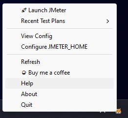

# Install

## Download

Download the latest version of Hamster for Windows from [here](https://github.com/QAInsights/hamster/releases).

## Install

Just like any other app, open the MSI package and follow the installation wizard. 

> If you notice that there is a warning to download, please check your download settings in your browser.

By default, Hamster will get it installed in this path `C:\Users\<user_name>\AppData\Local\Programs\QAInsights\Hamster\`.

## Launch Hamster

Once the installation is successful, launch Hamster by navigating to `Start`, search for `Hamster`. After successful launch, you can see `Hamster` in your Windows status bar.

