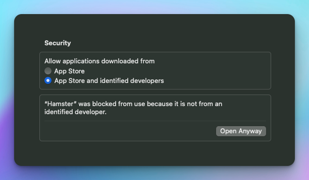
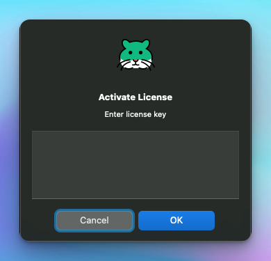
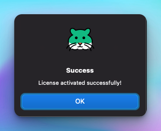
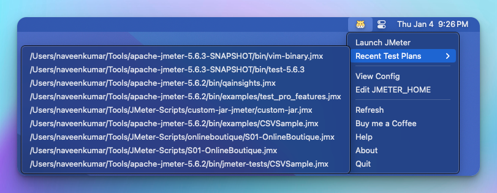

## Download

To purchase Hamster for Mac, go to [this link](https://qainsights.gumroad.com) and get the license key and the latest version.

## Installation

To install Hamster, open the DMG package and move it to the `Applications` folder.

When launching Hamster for the first time, you may need to allow it in `System Settings > Privacy & Security > Security > Open anyway`. Follow the subsequent actions as prompted.

## Activate License Key

After a successful installation, you can activate the license by navigating to `Hamster > Activate License`

## Launching Hamster

After a successful installation, you can launch Hamster from either the `Finder` or the `Applications` folder.

