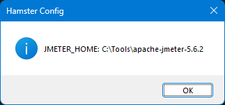

## Setup

If you want to install Hamster, please refer to [this](../../hamster-pro/windows/install.md) before proceeding.

The following are the prerequisites for setting up `Hamster` properly.

- [Apache JMeter](https://jmeter.apache.org)

## Setup JMeter Home

The first step in setting up `Hamster` is to configure the JMeter home path. Right-click on `Hamster > Configure JMETER_HOME`. This will open a dialog box to map the JMeter folder.

Only the parent folder of JMeter needs to be mapped, for example, `C:\Tools\apache-jmeter-5.6.3`, not `C:\Tools\apache-jmeter-5.6.3\bin`.

## View Config

To view the JMeter config, right-click on `Hamster > View Config`.

