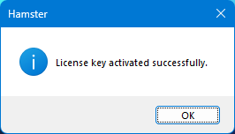

## Download

To purchase Hamster for Windows, go to [this link](https://qainsights.gumroad.com) and get the license key and the latest version.

## Installation

To install Hamster, open the MSI package and follow the installation wizard, just like any other app.

> If you encounter a warning during the download, please check your browser's download settings.

By default, Hamster will be installed in the following path: `C:\Users\<user_name>\AppData\Local\Programs\QAInsights\Hamster\`.

## Activate License Key

After a successful installation, you can activate the license by navigating to `Hamster > Activate License`

