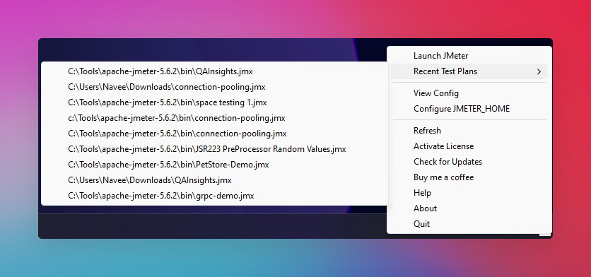

# Hamster

An app that puts your recent JMeter test plans just a click away from your Mac menu or Windows status bar.

## ✅ Features

- 🎯 No more digging through folders or endless searches. With Hamster, launching your recent JMeter test plans is swift and seamless. Boost your productivity by accessing your tests instantly, streamlining your workflow like never before.
- 🌟 Whether you're a seasoned JMeter pro or just getting started, Hamster's user-friendly interface makes your testing experience effortless. Say hello to smoother workflows and goodbye to unnecessary hassle!
- 🚀 Hamster is a lightweight app that's easy to install and use. It's also open-source, so you can customize it to your liking. What's more, it's free! So what are you waiting for? Download Hamster today and take your testing to the next level.
- 🏛️ Supports Intel and Apple Silicon architectures.
